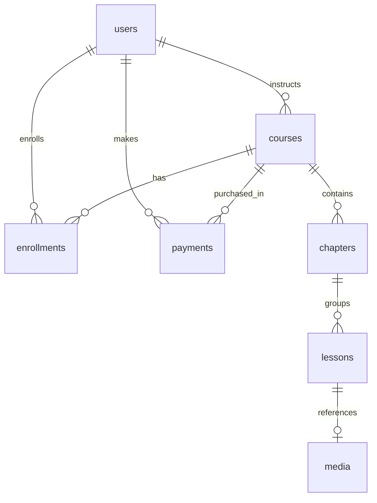

# Comprehensive Database Schema Design

The platform uses **PostgreSQL 18** managed via **Flyway Schema Migrations** (`db/migration/V1__...` through `V16__...`).

---

## 🗄️ Database Tables Specification

### 1. `users` (V1, V15)
Stores platform users (Students, Admins, Instructors).
- `id` (UUID, Primary Key)
- `email` (VARCHAR(255), Unique, Not Null)
- `password_hash` (VARCHAR(255), Not Null)
- `full_name` (VARCHAR(255))
- `role` (VARCHAR(50), Default 'STUDENT')
- `avatar_url` (VARCHAR(1000))
- `created_at` (TIMESTAMP WITH TIME ZONE)
- `updated_at` (TIMESTAMP WITH TIME ZONE)

### 2. `courses` (V2)
Stores course master data.
- `id` (UUID, Primary Key)
- `title` (VARCHAR(255), Not Null)
- `description` (TEXT)
- `instructor_id` (UUID, FK -> `users.id`)
- `price` (DECIMAL(38,2), Not Null)
- `status` (VARCHAR(50), Default 'DRAFT')
- `created_at` (TIMESTAMP WITH TIME ZONE)
- `updated_at` (TIMESTAMP WITH TIME ZONE)

### 3. `chapters` (V16)
Stores curriculum chapters within courses.
- `id` (UUID, Primary Key)
- `course_id` (UUID, Not Null, FK -> `courses.id`)
- `title` (VARCHAR(255), Not Null)
- `sequence_order` (INTEGER, Not Null, Default 1)
- `created_at` (TIMESTAMP WITH TIME ZONE)

### 4. `lessons` (V3, V16)
Stores learning lessons (Video, PDF, Image, Quiz).
- `id` (UUID, Primary Key)
- `course_id` (UUID, FK -> `courses.id`)
- `chapter_id` (UUID, FK -> `chapters.id`)
- `title` (VARCHAR(255), Not Null)
- `description` (TEXT)
- `content` (TEXT)
- `lesson_type` (VARCHAR(255)) -- VIDEO, IMAGE, PDF, QUIZ
- `content_url` (TEXT)
- `video_thumbnail_url` (TEXT)
- `quiz_data` (TEXT) -- JSON Encoded Quiz questions and answers
- `media_id` (UUID, FK -> `media.id`)
- `sequence_order` (INTEGER)
- `created_at` (TIMESTAMP WITH TIME ZONE)

### 5. `media` (V4)
Stores metadata for Cloudflare R2 uploaded files.
- `id` (UUID, Primary Key)
- `file_name` (VARCHAR(255), Not Null)
- `file_type` (VARCHAR(50), Not Null) -- VIDEO, IMAGE, PDF, REEL
- `object_key` (VARCHAR(500), Not Null)
- `file_size` (BIGINT)
- `duration` (INTEGER)
- `status` (VARCHAR(50), Not Null, Default 'READY')
- `uploader_id` (UUID, FK -> `users.id`)
- `created_at` (TIMESTAMP WITH TIME ZONE)

### 6. `enrollments` (V5)
Stores student course enrollments.
- `id` (UUID, Primary Key)
- `student_id` (UUID, Not Null, FK -> `users.id`)
- `course_id` (UUID, Not Null, FK -> `courses.id`)
- `enrolled_at` (TIMESTAMP WITH TIME ZONE)
- `CONSTRAINT unique_student_course UNIQUE(student_id, course_id)`

### 7. `payments` (V9)
Stores Razorpay payment transaction logs.
- `id` (UUID, Primary Key)
- `user_id` (UUID, Not Null, FK -> `users.id`)
- `course_id` (UUID, Not Null, FK -> `courses.id`)
- `amount` (DECIMAL(38,2), Not Null)
- `razorpay_order_id` (VARCHAR(255))
- `razorpay_payment_id` (VARCHAR(255))
- `status` (VARCHAR(50), Not Null, Default 'PENDING') -- PENDING, COMPLETED, FAILED
- `created_at` (TIMESTAMP WITH TIME ZONE)

### 8. `course_pricing` (V6)
Stores pricing history and discount structures.
- `id` (UUID, Primary Key)
- `course_id` (UUID, Not Null, FK -> `courses.id`)
- `base_price` (DECIMAL(38,2), Not Null)
- `discount_price` (DECIMAL(38,2))
- `currency` (VARCHAR(10), Default 'USD')

### 9. `campaigns` (V7)
Stores marketing campaigns and flash sales.
- `id` (UUID, Primary Key)
- `title` (VARCHAR(255), Not Null)
- `discount_percentage` (DECIMAL(38,2), Not Null)
- `start_date` (TIMESTAMP WITH TIME ZONE)
- `end_date` (TIMESTAMP WITH TIME ZONE)
- `is_active` (BOOLEAN, Default true)

### 10. `coupons` (V8)
Stores promotional discount coupons.
- `id` (UUID, Primary Key)
- `code` (VARCHAR(50), Unique, Not Null)
- `discount_amount` (DECIMAL(38,2), Not Null)
- `expiry_date` (TIMESTAMP WITH TIME ZONE)
- `usage_limit` (INTEGER)

### 11. `course_progress` (V10)
Tracks student lesson completion.
- `id` (UUID, Primary Key)
- `student_id` (UUID, Not Null, FK -> `users.id`)
- `lesson_id` (UUID, Not Null, FK -> `lessons.id`)
- `is_completed` (BOOLEAN, Default false)
- `completed_at` (TIMESTAMP WITH TIME ZONE)

### 12. `certificates` (V11)
Stores generated course completion certificates.
- `id` (UUID, Primary Key)
- `student_id` (UUID, Not Null, FK -> `users.id`)
- `course_id` (UUID, Not Null, FK -> `courses.id`)
- `certificate_url` (VARCHAR(500))
- `issued_at` (TIMESTAMP WITH TIME ZONE)

### 13. `reviews` (V12)
Stores student course ratings and reviews.
- `id` (UUID, Primary Key)
- `student_id` (UUID, Not Null, FK -> `users.id`)
- `course_id` (UUID, Not Null, FK -> `courses.id`)
- `rating` (INTEGER, Not Null)
- `comment` (TEXT)
- `created_at` (TIMESTAMP WITH TIME ZONE)

### 14. `wishlists` (V13)
Stores student saved courses.
- `id` (UUID, Primary Key)
- `student_id` (UUID, Not Null, FK -> `users.id`)
- `course_id` (UUID, Not Null, FK -> `courses.id`)

### 15. `audit_logs` (V14)
Stores system audit and security events.
- `id` (UUID, Primary Key)
- `user_id` (UUID)
- `action` (VARCHAR(255), Not Null)
- `details` (TEXT)
- `created_at` (TIMESTAMP WITH TIME ZONE)

---

## 🔗 Entity Relationship Summary (Mermaid)

