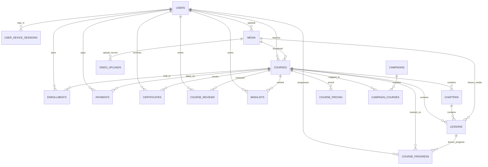
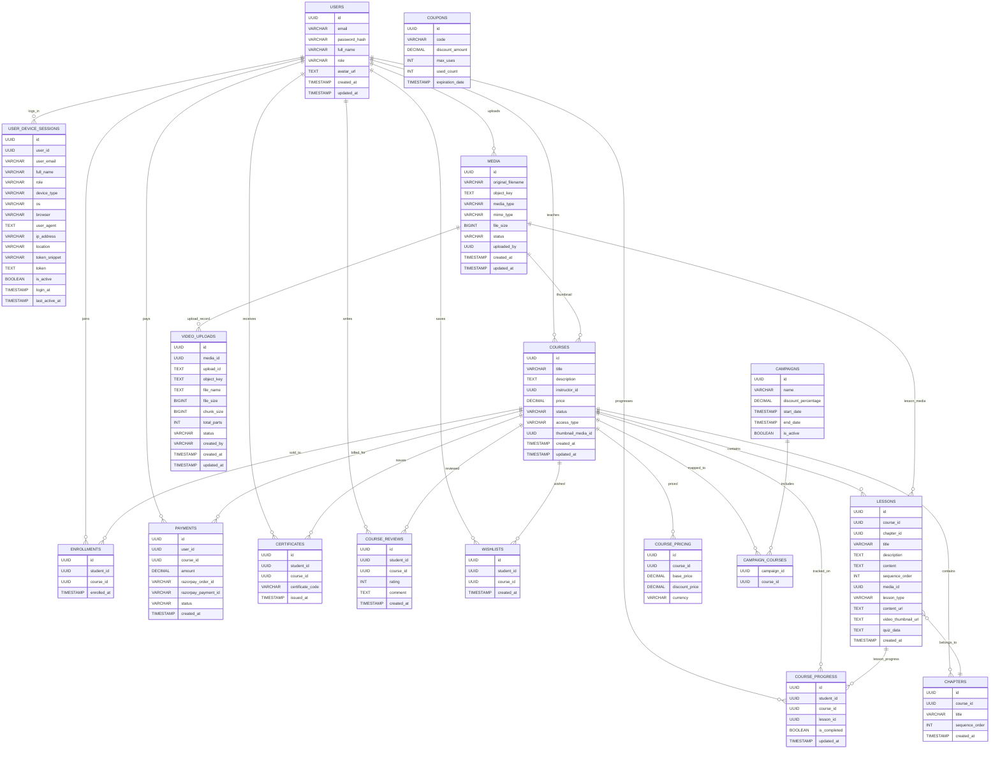

# Database Schema Overview

This document explains the relational structure of the Learning Platform database based on the Flyway migration files under `LearningPlatformApplication/src/main/resources/db/migration`.

## 1. Core concept

The main domain objects are:

- `users` — application users (students, instructors, admins)
- `courses` — learning products
- `chapters` — course sections
- `lessons` — course content units
- `media` — uploaded files and media metadata
- `enrollments`, `payments`, `progress`, `reviews`, `wishlists`, `certificates` — learner activity/history
- `campaigns` and `campaign_courses` — marketing/category grouping
- `audit_logs` — operational activity tracking
- `user_device_sessions` — login/session tracking

---

## 2. Entity relationship summary

---

## 3. Table-by-table dependency map

### users

Source: `V1__create_users.sql`

Purpose:
- central user table for all platform actors

Relations:
- `courses.instructor_id -> users.id`
- `enrollments.student_id -> users.id`
- `payments.user_id -> users.id`
- `course_progress.student_id -> users.id`
- `certificates.student_id -> users.id`
- `course_reviews.student_id -> users.id`
- `wishlists.student_id -> users.id`
- `user_device_sessions.user_id` (logical relationship)

Why important:
- `users` is the hub of the entire system

---

### courses

Source: `V2__create_courses.sql`

Purpose:
- primary learning content entity

Columns:
- `id` — course identifier
- `title` — course title
- `description` — course description
- `instructor_id` — owner/instructor user
- `price` — base course price
- `status` — lifecycle status such as `DRAFT`, `PUBLISHED`
- `access_type` — free or paid access
- `thumbnail_media_id` — media asset reference
- `created_at`, `updated_at` — audit timestamps

Relations:
- `courses.instructor_id -> users.id`
- `chapters.course_id -> courses.id`
- `lessons.course_id -> courses.id`
- `enrollments.course_id -> courses.id`
- `payments.course_id -> courses.id`
- `course_progress.course_id -> courses.id`
- `certificates.course_id -> courses.id`
- `course_reviews.course_id -> courses.id`
- `wishlists.course_id -> courses.id`
- `course_pricing.course_id -> courses.id`
- `campaign_courses.course_id -> courses.id`

Why important:
- most activity in the platform depends on a course
- deleting a course without cleaning up dependent rows can destroy learner history and payment records

---

### chapters

Source: `V16__create_chapters_and_quizzes.sql`

Purpose:
- groups lessons into logical sections of a course

Relations:
- `chapters.course_id -> courses.id`
- `lessons.chapter_id -> chapters.id`

Why important:
- forms the structural hierarchy: course -> chapter -> lesson

---

### lessons

Source: `V3__create_lessons.sql` and altered by `V16__create_chapters_and_quizzes.sql`

Purpose:
- the actual learning unit inside a course

Original schema:
- `id`
- `course_id -> courses.id` with `ON DELETE CASCADE`
- `title`
- `description`
- `content`
- `sequence_order`
- `media_id`
- `created_at`

Later columns added:
- `chapter_id -> chapters.id` with `ON DELETE CASCADE`
- `lesson_type`
- `content_url`
- `video_thumbnail_url`
- `quiz_data`

Relations:
- `lessons.course_id -> courses.id`
- `lessons.chapter_id -> chapters.id`
- `course_progress.lesson_id -> lessons.id`

Why important:
- lesson is the smallest unit of content and is referenced by progress tracking

---

### media

Source: `V4__create_media.sql`

Purpose:
- stores uploaded file metadata in the platform

Relations:
- `courses.thumbnail_media_id` logically references media
- `lessons.media_id` logically references media
- `video_uploads.media_id -> media.id`

Why important:
- media is a shared asset layer used by courses, lesson content, and uploads

---

### enrollments

Source: `V5__create_enrollments.sql`

Purpose:
- tracks the fact that a student enrolled in a course

Relations:
- `enrollments.student_id -> users.id`
- `enrollments.course_id -> courses.id`

Constraints:
- `unique_student_course` ensures one student can only enroll once per course

Why important:
- this is the core course participation table

---

### course_pricing

Source: `V6__create_pricing.sql`

Purpose:
- stores pricing information linked to a course

Relations:
- `course_pricing.course_id -> courses.id`

Why important:
- keeps pricing rules separate from general course metadata

---

### campaigns and campaign_courses

Source: `V7__create_campaigns.sql`

Purpose:
- marketing campaigns and their course memberships

Relations:
- `campaign_courses.campaign_id -> campaigns.id`
- `campaign_courses.course_id -> courses.id`

Why important:
- many-to-many mapping between campaigns and courses

---

### coupons

Source: `V8__create_coupons.sql`

Purpose:
- discount or redemption code storage

Relations:
- no direct foreign key to users or courses in this migration

Why important:
- likely used in checkout or promotion logic, but not tied to a course by default

---

### payments

Source: `V9__create_payments.sql`

Purpose:
- stores checkout and payment transactions

Relations:
- `payments.user_id -> users.id`
- `payments.course_id -> courses.id`

Why important:
- financial history for course purchases
- this is one of the most sensitive data sets in the app

---

### course_progress

Source: `V10__create_progress.sql`

Purpose:
- tracks a student’s completion state for lessons

Relations:
- `course_progress.student_id -> users.id`
- `course_progress.course_id -> courses.id`
- `course_progress.lesson_id -> lessons.id`

Constraints:
- unique `(student_id, lesson_id)` prevents duplicate lesson progress rows

Why important:
- connects a student to a specific course and lesson during learning

---

### certificates

Source: `V11__create_certificates.sql`

Purpose:
- records course completion certificates

Relations:
- `certificates.student_id -> users.id`
- `certificates.course_id -> courses.id`

Why important:
- represents earned credentials and should not be casually deleted

---

### course_reviews

Source: `V12__create_reviews.sql`

Purpose:
- stores student ratings and comments for courses

Relations:
- `course_reviews.student_id -> users.id`
- `course_reviews.course_id -> courses.id`

Why important:
- user-generated feedback tied to a course

---

### wishlists

Source: `V13__create_wishlists.sql`

Purpose:
- stores a student’s saved course list

Relations:
- `wishlists.student_id -> users.id`
- `wishlists.course_id -> courses.id`

Constraints:
- unique `(student_id, course_id)` stops duplicates

Why important:
- user preference data tied to course selection

---

### audit_logs

Source: `V14__create_audit_logs.sql`

Purpose:
- generic audit trail of admin/system actions

Relations:
- no strict foreign key relationships

Why important:
- acts as operational logs rather than a canonical relational model

---

### video_uploads

Source: `V17__create_video_uploads.sql`

Purpose:
- stores multipart upload state for video files uploaded to storage

Relations:
- logical relation to `media.id` via `media_id`

Why important:
- supports media processing workflows and migration to object storage

---

### user_device_sessions

Source: `V18__create_user_device_sessions.sql`, `V19__add_token_to_user_device_sessions.sql`

Purpose:
- tracks active logins/devices for a user

Relations:
- logically references `users.id` through `user_id` but not enforced as a foreign key in the migration

Why important:
- important for session auditing and device-based security logic

---

## 4. Most important dependency chain

The highest-value dependency graph is:

`users -> courses -> chapters -> lessons`

Then auxiliary learning activity tables attach to this graph:

- `enrollments` connects users and courses
- `course_progress` connects users, courses, lessons
- `payments` connects users and courses
- `certificates` connects users and courses
- `course_reviews` connects users and courses
- `wishlists` connects users and courses
- `campaign_courses` connects campaigns and courses

This is why a course deletion must be handled carefully.

---

## 5. Why deleting a course is risky

The schema shows that `courses.id` is referenced by many tables:

- `chapters`
- `lessons`
- `enrollments`
- `course_pricing`
- `payments`
- `course_progress`
- `certificates`
- `course_reviews`
- `wishlists`
- `campaign_courses`

If a course is deleted without planned cleanup, then:

- student enrollment records are lost
- payment history is lost
- course progress disappears
- certificates become orphaned or invalid
- reviews disappear
- wishlist entries are lost
- marketing campaigns lose their course mapping

This makes the earlier hard-delete implementation unsafe.

---

## 6. Recommended design pattern

For a production learning platform, prefer:

- soft delete on `courses` using a status such as `DELETED`
- keep historical tables such as `payments`, `course_progress`, `certificates`, and `enrollments`
- only delete non-critical metadata or generated records when necessary
- use explicit admin cleanup flow for permanent deletion if required

This preserves data integrity while hiding deleted courses from normal users.

---

## 7. Summary

The database is organized around a central course model:

- `users` are the people
- `courses` are the products
- `chapters` and `lessons` define the content
- `enrollments`, `payments`, `progress`, `certificates`, `reviews`, and `wishlists` are the learning lifecycle around the course
- `campaigns` and `campaign_courses` add promotions and catalog grouping
- `media` and `video_uploads` support the content delivery layer

This is a rich relational graph, and the main rule is: course deletion must not be treated as a simple row removal.

# Database Relationship Diagram

This ER diagram shows how the core tables in the learning platform relate to one another.

## Relationship summary

- USERS is the main identity node.
- COURSES is the center of content and purchase flows.
- LESSONS and CHAPTERS structure the learning content.
- ENROLLMENTS, PAYMENTS, COURSE_PROGRESS, CERTIFICATES, COURSE_REVIEWS, and WISHLISTS describe learner behavior.
- MEDIA and VIDEO_UPLOADS represent uploaded assets and storage metadata.
- CAMPAIGNS and CAMPAIGN_COURSES connect marketing offers to courses.
- USER_DEVICE_SESSIONS tracks login and device activity.

This file is ready to be pushed to GitHub and GitHub will render the Mermaid diagram automatically.
