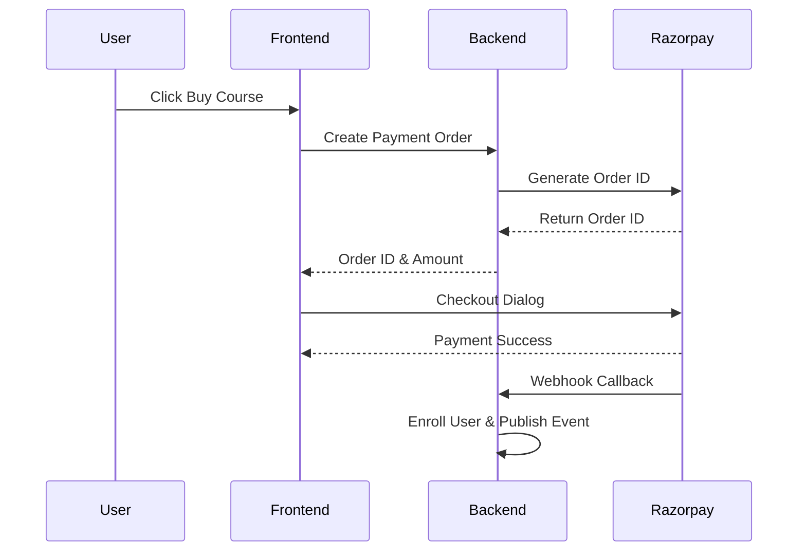

# Payment Flow Diagram

```mermaid
sequenceDiagram
    participant User
    participant Frontend
    participant Backend
    participant Razorpay
    User->>Frontend: Click Buy Course
    Frontend->>Backend: Create Payment Order
    Backend->>Razorpay: Generate Order ID
    Razorpay-->>Backend: Return Order ID
    Backend-->>Frontend: Order ID & Amount
    Frontend->>Razorpay: Checkout Dialog
    Razorpay-->>Frontend: Payment Success
    Razorpay->>Backend: Webhook Callback
    Backend->>Backend: Enroll User & Publish Event
```
