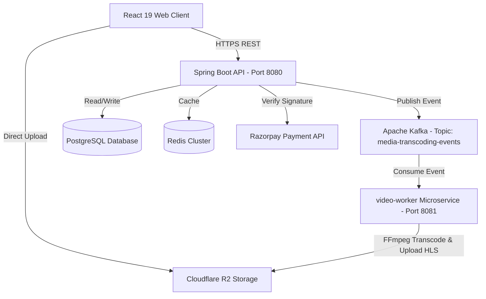
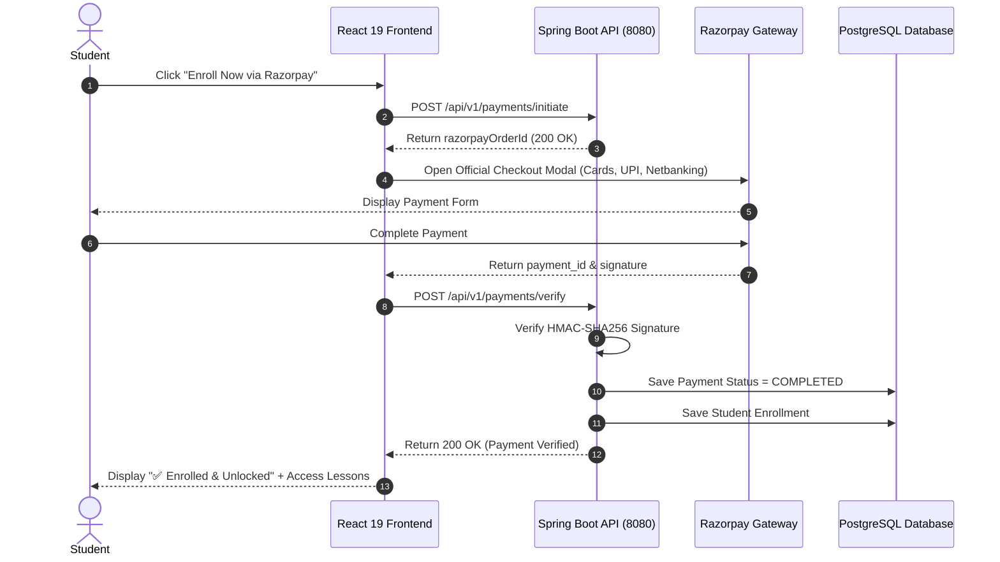
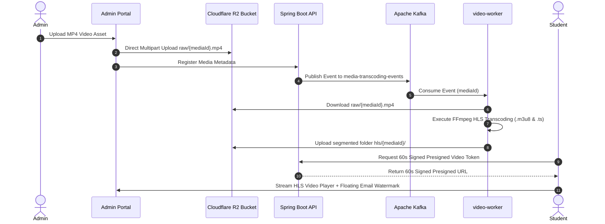

# Architectural Mermaid Diagrams

## 1. End-to-End System Architecture

```mermaid
graph TD
    Client[React 19 Web Client] -->|HTTPS REST| Gateway[Spring Boot API - Port 8080]
    Client -->|Direct Upload| R2[Cloudflare R2 Storage]
    Gateway -->|Publish Event| Kafka[Apache Kafka - Topic: media-transcoding-events]
    Kafka -->|Consume Event| Worker[video-worker Microservice - Port 8081]
    Worker -->|FFmpeg Transcode & Upload HLS| R2
    Gateway -->|Read/Write| Postgres[(PostgreSQL Database)]
    Gateway -->|Cache| Redis[(Redis Cluster)]
    Gateway -->|Verify Signature| Razorpay[Razorpay Payment API]
```

## 2. Razorpay Payment & Enrollment Checkout Flow

```mermaid
sequenceDiagram
    autonumber
    actor Student
    participant React as React 19 Frontend
    participant API as Spring Boot API (8080)
    participant Rzp as Razorpay Gateway
    participant DB as PostgreSQL Database

    Student->>React: Click "Enroll Now via Razorpay"
    React->>API: POST /api/v1/payments/initiate
    API-->>React: Return razorpayOrderId (200 OK)
    React->>Rzp: Open Official Checkout Modal (Cards, UPI, Netbanking)
    Rzp-->>Student: Display Payment Form
    Student->>Rzp: Complete Payment
    Rzp-->>React: Return payment_id & signature
    React->>API: POST /api/v1/payments/verify
    API->>API: Verify HMAC-SHA256 Signature
    API->>DB: Save Payment Status = COMPLETED
    API->>DB: Save Student Enrollment
    API-->>React: Return 200 OK (Payment Verified)
    React-->>Student: Display "✅ Enrolled & Unlocked" + Access Lessons
```

## 3. Video Transcoding & HLS Streaming Pipeline

```mermaid
sequenceDiagram
    autonumber
    actor Admin
    participant Frontend as Admin Portal
    participant R2 as Cloudflare R2 Bucket
    participant Backend as Spring Boot API
    participant Kafka as Apache Kafka
    participant Worker as video-worker
    actor Student

    Admin->>Frontend: Upload MP4 Video Asset
    Frontend->>R2: Direct Multipart Upload raw/{mediaId}.mp4
    Frontend->>Backend: Register Media Metadata
    Backend->>Kafka: Publish Event to media-transcoding-events
    Kafka->>Worker: Consume Event (mediaId)
    Worker->>R2: Download raw/{mediaId}.mp4
    Worker->>Worker: Execute FFmpeg HLS Transcoding (.m3u8 & .ts)
    Worker->>R2: Upload segmented folder hls/{mediaId}/
    Student->>Backend: Request 60s Signed Presigned Video Token
    Backend-->>Student: Return 60s Signed Presigned URL
    Student->>Frontend: Stream HLS Video Player + Floating Email Watermark
```
