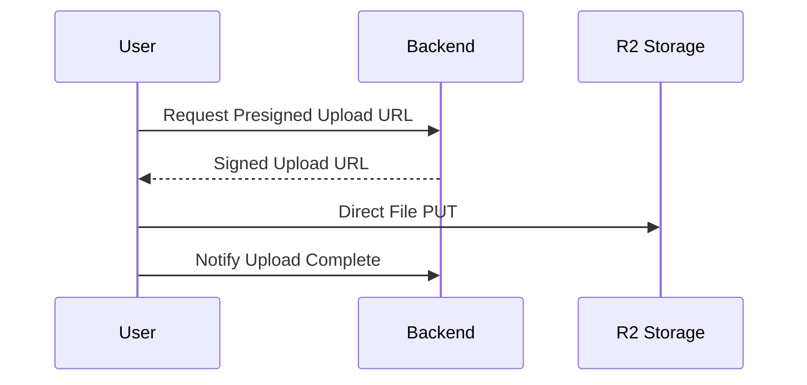

# Direct Upload Flow Diagram

```mermaid
sequenceDiagram
    participant User
    participant Backend
    participant R2 Storage
    User->>Backend: Request Presigned Upload URL
    Backend-->>User: Signed Upload URL
    User->>R2 Storage: Direct File PUT
    User->>Backend: Notify Upload Complete
```
