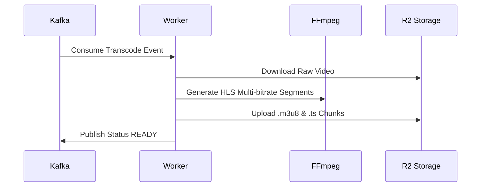

# Video Transcoding Flow Diagram

```mermaid
sequenceDiagram
    participant Kafka
    participant Worker
    participant FFmpeg
    participant R2 Storage
    Kafka->>Worker: Consume Transcode Event
    Worker->>R2 Storage: Download Raw Video
    Worker->>FFmpeg: Generate HLS Multi-bitrate Segments
    Worker->>R2 Storage: Upload .m3u8 & .ts Chunks
    Worker->>Kafka: Publish Status READY
```
